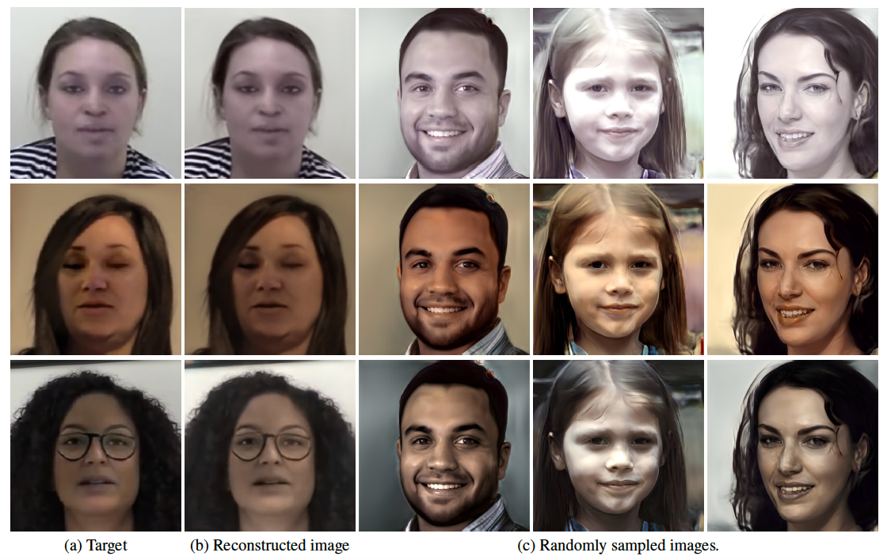

# One Shot Domain Adaptation For FaceGeneration
This repository contains our PyTorch evaluation code and pretrained models for One Shot Domain Adaptation For FaceGeneration.

<p align="center"><a href="https://youtu.be/4uiptTUyq30">
  </a>
<br>
Given a single target image, we could reconstruct the image using StyleGAN and generate many more similar looking images. 
</p>

For more details, please see [One-Shot Domain Adaptation For Face Generation](https://arxiv.org/abs/2003.12869 "One-Shot Domain Adaptation For Face Generation") by Harry (Chao) Yang and Ser-Nam Lim.

If you find this repo useful in your research, please consider citing our work:

```BibTex
@InProceedings{Yang_2020_CVPR,
author = {Yang, Chao and Lim, Ser-Nam},
title = {One-Shot Domain Adaptation for Face Generation},
booktitle = {Proceedings of the IEEE/CVF Conference on Computer Vision and Pattern Recognition (CVPR)},
month = {June},
year = {2020}
}
```

## Run
Please download StyleGAN pretrained pytorch models and dlib landmark detector model from [Google Drive](https://drive.google.com/drive/folders/11jrNdAa6gdNBXB7dinei47wDk4c01zNg?usp=sharing)
```
python one_shot_domain_adaptation.py --img_name ./test_data/autoencoder.png --verbose
```
All intermediate and final results are saved under test_results/test.

## License
One Shot Domain Adaptation for Face Generation is CC-BY-4.0 licensed, as found in the LICENSE file. Some of the codes are adapted from [NVIDIA FFHQ](https://github.com/NVlabs/ffhq-dataset) and [StyleGAN PyTorch](https://github.com/lernapparat/lernapparat/tree/master/style_gan) and share their licenses.

## Contributing
We actively welcome your pull requests! Please see [CONTRIBUTING](CONTRIBUTING.md) and [CODE_OF_CONDUCT](CODE_OF_CONDUCT.md) for more info.
